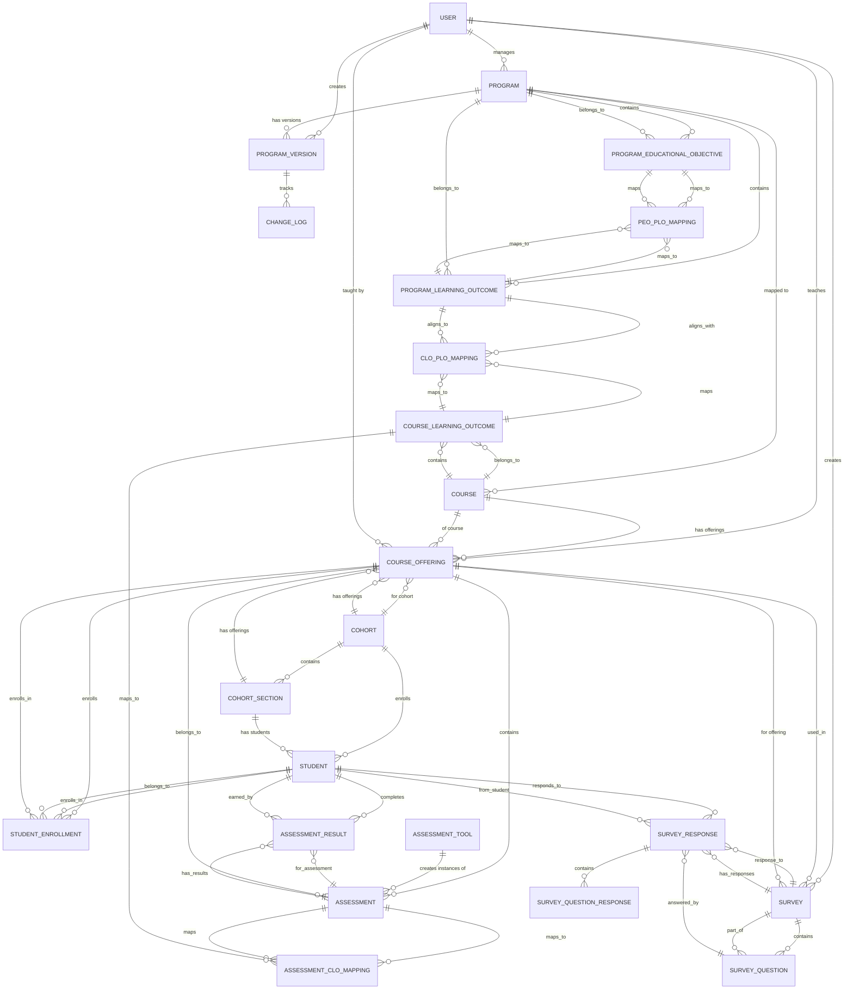

# OBE Management System - Database Design

## Entity Relationship Diagram



---

## Table Schemas

### 1. **USER**
```sql
CREATE TABLE user (
    id INT PRIMARY KEY AUTO_INCREMENT,
    username VARCHAR(150) UNIQUE NOT NULL,
    email VARCHAR(255) UNIQUE NOT NULL,
    password_hash VARCHAR(255) NOT NULL,
    first_name VARCHAR(100),
    last_name VARCHAR(100),
    role ENUM('admin', 'dean', 'program_controller', 'instructor', 'student') NOT NULL,
    department VARCHAR(100),
    created_at TIMESTAMP DEFAULT CURRENT_TIMESTAMP,
    updated_at TIMESTAMP DEFAULT CURRENT_TIMESTAMP ON UPDATE CURRENT_TIMESTAMP,
    is_active BOOLEAN DEFAULT TRUE
);
```

### 2. **PROGRAM**
```sql
CREATE TABLE program (
    id INT PRIMARY KEY AUTO_INCREMENT,
    code VARCHAR(50) UNIQUE NOT NULL,
    name VARCHAR(255) NOT NULL,
    description TEXT,
    program_controller_id INT NOT NULL,
    status ENUM('new', 'draft', 'active', 'archived') DEFAULT 'new',
    current_version INT DEFAULT 0,
    vision TEXT,
    mission TEXT,
    created_at TIMESTAMP DEFAULT CURRENT_TIMESTAMP,
    updated_at TIMESTAMP DEFAULT CURRENT_TIMESTAMP ON UPDATE CURRENT_TIMESTAMP,
    FOREIGN KEY (program_controller_id) REFERENCES user(id)
);
```

### 3. **PROGRAM_VERSION**
```sql
CREATE TABLE program_version (
    id INT PRIMARY KEY AUTO_INCREMENT,
    program_id INT NOT NULL,
    version_number INT NOT NULL,
    created_by INT NOT NULL,
    created_at TIMESTAMP DEFAULT CURRENT_TIMESTAMP,
    sections_modified JSON,
    comments TEXT,
    FOREIGN KEY (program_id) REFERENCES program(id) ON DELETE CASCADE,
    FOREIGN KEY (created_by) REFERENCES user(id),
    UNIQUE KEY unique_version (program_id, version_number)
);
```

### 4. **CHANGE_LOG**
```sql
CREATE TABLE change_log (
    id INT PRIMARY KEY AUTO_INCREMENT,
    program_version_id INT NOT NULL,
    field_name VARCHAR(100),
    old_value TEXT,
    new_value TEXT,
    created_at TIMESTAMP DEFAULT CURRENT_TIMESTAMP,
    FOREIGN KEY (program_version_id) REFERENCES program_version(id) ON DELETE CASCADE
);
```

### 5. **PROGRAM_EDUCATIONAL_OBJECTIVE** (PEO)
```sql
CREATE TABLE program_educational_objective (
    id INT PRIMARY KEY AUTO_INCREMENT,
    program_id INT NOT NULL,
    code VARCHAR(50),
    title VARCHAR(255) NOT NULL,
    description TEXT NOT NULL,
    order_index INT,
    created_at TIMESTAMP DEFAULT CURRENT_TIMESTAMP,
    updated_at TIMESTAMP DEFAULT CURRENT_TIMESTAMP ON UPDATE CURRENT_TIMESTAMP,
    FOREIGN KEY (program_id) REFERENCES program(id) ON DELETE CASCADE
);
```

### 6. **PROGRAM_LEARNING_OUTCOME** (PLO)
```sql
CREATE TABLE program_learning_outcome (
    id INT PRIMARY KEY AUTO_INCREMENT,
    program_id INT NOT NULL,
    code VARCHAR(50),
    title VARCHAR(255) NOT NULL,
    description TEXT NOT NULL,
    order_index INT,
    source ENUM('custom', 'abet', 'baete', 'ieee') DEFAULT 'custom',
    created_at TIMESTAMP DEFAULT CURRENT_TIMESTAMP,
    updated_at TIMESTAMP DEFAULT CURRENT_TIMESTAMP ON UPDATE CURRENT_TIMESTAMP,
    FOREIGN KEY (program_id) REFERENCES program(id) ON DELETE CASCADE
);
```

### 7. **PEO_PLO_MAPPING**
```sql
CREATE TABLE peo_plo_mapping (
    id INT PRIMARY KEY AUTO_INCREMENT,
    program_id INT NOT NULL,
    peo_id INT NOT NULL,
    plo_id INT NOT NULL,
    strength ENUM('weak', 'medium', 'strong') DEFAULT 'medium',
    created_at TIMESTAMP DEFAULT CURRENT_TIMESTAMP,
    updated_at TIMESTAMP DEFAULT CURRENT_TIMESTAMP ON UPDATE CURRENT_TIMESTAMP,
    FOREIGN KEY (program_id) REFERENCES program(id) ON DELETE CASCADE,
    FOREIGN KEY (peo_id) REFERENCES program_educational_objective(id) ON DELETE CASCADE,
    FOREIGN KEY (plo_id) REFERENCES program_learning_outcome(id) ON DELETE CASCADE,
    UNIQUE KEY unique_mapping (peo_id, plo_id)
);
```

### 8. **COURSE**
```sql
CREATE TABLE course (
    id INT PRIMARY KEY AUTO_INCREMENT,
    code VARCHAR(50) UNIQUE NOT NULL,
    name VARCHAR(255) NOT NULL,
    description TEXT,
    credit_hours DECIMAL(3,1),
    semester_offered INT,
    created_at TIMESTAMP DEFAULT CURRENT_TIMESTAMP,
    updated_at TIMESTAMP DEFAULT CURRENT_TIMESTAMP ON UPDATE CURRENT_TIMESTAMP
);
```

### 9. **COURSE_PROGRAM_MAPPING**
```sql
CREATE TABLE course_program_mapping (
    id INT PRIMARY KEY AUTO_INCREMENT,
    course_id INT NOT NULL,
    program_id INT NOT NULL,
    is_required BOOLEAN DEFAULT TRUE,
    order_index INT,
    created_at TIMESTAMP DEFAULT CURRENT_TIMESTAMP,
    FOREIGN KEY (course_id) REFERENCES course(id) ON DELETE CASCADE,
    FOREIGN KEY (program_id) REFERENCES program(id) ON DELETE CASCADE,
    UNIQUE KEY unique_mapping (course_id, program_id)
);
```

### 10. **COURSE_LEARNING_OUTCOME** (CLO)
```sql
CREATE TABLE course_learning_outcome (
    id INT PRIMARY KEY AUTO_INCREMENT,
    course_id INT NOT NULL,
    code VARCHAR(50),
    title VARCHAR(255) NOT NULL,
    description TEXT NOT NULL,
    order_index INT,
    created_at TIMESTAMP DEFAULT CURRENT_TIMESTAMP,
    updated_at TIMESTAMP DEFAULT CURRENT_TIMESTAMP ON UPDATE CURRENT_TIMESTAMP,
    FOREIGN KEY (course_id) REFERENCES course(id) ON DELETE CASCADE
);
```

### 11. **CLO_PLO_MAPPING**
```sql
CREATE TABLE clo_plo_mapping (
    id INT PRIMARY KEY AUTO_INCREMENT,
    clo_id INT NOT NULL,
    plo_id INT NOT NULL,
    strength ENUM('weak', 'medium', 'strong') DEFAULT 'medium',
    created_at TIMESTAMP DEFAULT CURRENT_TIMESTAMP,
    updated_at TIMESTAMP DEFAULT CURRENT_TIMESTAMP ON UPDATE CURRENT_TIMESTAMP,
    FOREIGN KEY (clo_id) REFERENCES course_learning_outcome(id) ON DELETE CASCADE,
    FOREIGN KEY (plo_id) REFERENCES program_learning_outcome(id) ON DELETE CASCADE,
    UNIQUE KEY unique_mapping (clo_id, plo_id)
);
```

### 12. **COHORT**
```sql
CREATE TABLE cohort (
    id INT PRIMARY KEY AUTO_INCREMENT,
    program_id INT NOT NULL,
    code VARCHAR(50),
    name VARCHAR(255) NOT NULL,
    start_year INT,
    graduation_year INT,
    total_students INT DEFAULT 0,
    status ENUM('active', 'completed', 'archived') DEFAULT 'active',
    created_at TIMESTAMP DEFAULT CURRENT_TIMESTAMP,
    updated_at TIMESTAMP DEFAULT CURRENT_TIMESTAMP ON UPDATE CURRENT_TIMESTAMP,
    FOREIGN KEY (program_id) REFERENCES program(id) ON DELETE CASCADE
);
```

### 13. **COHORT_SECTION**
```sql
CREATE TABLE cohort_section (
    id INT PRIMARY KEY AUTO_INCREMENT,
    cohort_id INT NOT NULL,
    code VARCHAR(50),
    name VARCHAR(255) NOT NULL,
    total_students INT DEFAULT 0,
    created_at TIMESTAMP DEFAULT CURRENT_TIMESTAMP,
    updated_at TIMESTAMP DEFAULT CURRENT_TIMESTAMP ON UPDATE CURRENT_TIMESTAMP,
    FOREIGN KEY (cohort_id) REFERENCES cohort(id) ON DELETE CASCADE
);
```

### 14. **STUDENT**
```sql
CREATE TABLE student (
    id INT PRIMARY KEY AUTO_INCREMENT,
    user_id INT NOT NULL UNIQUE,
    student_id VARCHAR(50) UNIQUE NOT NULL,
    cohort_id INT NOT NULL,
    section_id INT,
    enrollment_status ENUM('active', 'suspended', 'graduated', 'transferred') DEFAULT 'active',
    created_at TIMESTAMP DEFAULT CURRENT_TIMESTAMP,
    updated_at TIMESTAMP DEFAULT CURRENT_TIMESTAMP ON UPDATE CURRENT_TIMESTAMP,
    FOREIGN KEY (user_id) REFERENCES user(id) ON DELETE CASCADE,
    FOREIGN KEY (cohort_id) REFERENCES cohort(id) ON DELETE CASCADE,
    FOREIGN KEY (section_id) REFERENCES cohort_section(id) ON DELETE SET NULL
);
```

### 15. **COURSE_OFFERING**
```sql
CREATE TABLE course_offering (
    id INT PRIMARY KEY AUTO_INCREMENT,
    course_id INT NOT NULL,
    cohort_id INT NOT NULL,
    section_id INT,
    instructor_id INT NOT NULL,
    semester VARCHAR(20),
    year INT,
    capacity INT,
    enrolled_count INT DEFAULT 0,
    status ENUM('planned', 'active', 'completed', 'cancelled') DEFAULT 'planned',
    created_at TIMESTAMP DEFAULT CURRENT_TIMESTAMP,
    updated_at TIMESTAMP DEFAULT CURRENT_TIMESTAMP ON UPDATE CURRENT_TIMESTAMP,
    FOREIGN KEY (course_id) REFERENCES course(id),
    FOREIGN KEY (cohort_id) REFERENCES cohort(id),
    FOREIGN KEY (section_id) REFERENCES cohort_section(id) ON DELETE SET NULL,
    FOREIGN KEY (instructor_id) REFERENCES user(id)
);
```

### 16. **STUDENT_ENROLLMENT**
```sql
CREATE TABLE student_enrollment (
    id INT PRIMARY KEY AUTO_INCREMENT,
    student_id INT NOT NULL,
    course_offering_id INT NOT NULL,
    grade VARCHAR(2),
    gpa_points DECIMAL(3,2),
    enrollment_status ENUM('enrolled', 'dropped', 'completed', 'failed') DEFAULT 'enrolled',
    enrollment_date TIMESTAMP DEFAULT CURRENT_TIMESTAMP,
    completion_date TIMESTAMP NULL,
    FOREIGN KEY (student_id) REFERENCES student(id) ON DELETE CASCADE,
    FOREIGN KEY (course_offering_id) REFERENCES course_offering(id) ON DELETE CASCADE,
    UNIQUE KEY unique_enrollment (student_id, course_offering_id)
);
```

### 17. **ASSESSMENT_TOOL**
```sql
CREATE TABLE assessment_tool (
    id INT PRIMARY KEY AUTO_INCREMENT,
    name VARCHAR(100) NOT NULL,
    description TEXT,
    tool_type ENUM('standard', 'custom') DEFAULT 'standard',
    created_at TIMESTAMP DEFAULT CURRENT_TIMESTAMP
);
```

### 18. **ASSESSMENT**
```sql
CREATE TABLE assessment (
    id INT PRIMARY KEY AUTO_INCREMENT,
    course_offering_id INT NOT NULL,
    tool_id INT NOT NULL,
    title VARCHAR(255) NOT NULL,
    description TEXT,
    max_marks INT NOT NULL,
    weightage DECIMAL(5,2) DEFAULT 0,
    due_date DATE,
    assessment_date TIMESTAMP,
    created_at TIMESTAMP DEFAULT CURRENT_TIMESTAMP,
    updated_at TIMESTAMP DEFAULT CURRENT_TIMESTAMP ON UPDATE CURRENT_TIMESTAMP,
    FOREIGN KEY (course_offering_id) REFERENCES course_offering(id) ON DELETE CASCADE,
    FOREIGN KEY (tool_id) REFERENCES assessment_tool(id)
);
```

### 19. **ASSESSMENT_CLO_MAPPING**
```sql
CREATE TABLE assessment_clo_mapping (
    id INT PRIMARY KEY AUTO_INCREMENT,
    assessment_id INT NOT NULL,
    clo_id INT NOT NULL,
    marks_allocated INT,
    created_at TIMESTAMP DEFAULT CURRENT_TIMESTAMP,
    FOREIGN KEY (assessment_id) REFERENCES assessment(id) ON DELETE CASCADE,
    FOREIGN KEY (clo_id) REFERENCES course_learning_outcome(id) ON DELETE CASCADE,
    UNIQUE KEY unique_mapping (assessment_id, clo_id)
);
```

### 20. **ASSESSMENT_RESULT**
```sql
CREATE TABLE assessment_result (
    id INT PRIMARY KEY AUTO_INCREMENT,
    assessment_id INT NOT NULL,
    student_id INT NOT NULL,
    marks_obtained INT,
    percentage DECIMAL(5,2),
    submission_date TIMESTAMP,
    graded_date TIMESTAMP NULL,
    graded_by INT,
    feedback TEXT,
    created_at TIMESTAMP DEFAULT CURRENT_TIMESTAMP,
    updated_at TIMESTAMP DEFAULT CURRENT_TIMESTAMP ON UPDATE CURRENT_TIMESTAMP,
    FOREIGN KEY (assessment_id) REFERENCES assessment(id) ON DELETE CASCADE,
    FOREIGN KEY (student_id) REFERENCES student(id) ON DELETE CASCADE,
    FOREIGN KEY (graded_by) REFERENCES user(id),
    UNIQUE KEY unique_result (assessment_id, student_id)
);
```

### 21. **SURVEY**
```sql
CREATE TABLE survey (
    id INT PRIMARY KEY AUTO_INCREMENT,
    course_offering_id INT NOT NULL,
    title VARCHAR(255) NOT NULL,
    description TEXT,
    survey_type ENUM('feedback', 'assessment', 'satisfaction') DEFAULT 'feedback',
    start_date TIMESTAMP,
    end_date TIMESTAMP,
    status ENUM('draft', 'active', 'closed', 'archived') DEFAULT 'draft',
    created_by INT NOT NULL,
    created_at TIMESTAMP DEFAULT CURRENT_TIMESTAMP,
    updated_at TIMESTAMP DEFAULT CURRENT_TIMESTAMP ON UPDATE CURRENT_TIMESTAMP,
    FOREIGN KEY (course_offering_id) REFERENCES course_offering(id) ON DELETE CASCADE,
    FOREIGN KEY (created_by) REFERENCES user(id)
);
```

### 22. **SURVEY_QUESTION**
```sql
CREATE TABLE survey_question (
    id INT PRIMARY KEY AUTO_INCREMENT,
    survey_id INT NOT NULL,
    question_text TEXT NOT NULL,
    question_type ENUM('multiple_choice', 'likert', 'text', 'rating') DEFAULT 'likert',
    order_index INT,
    is_required BOOLEAN DEFAULT TRUE,
    created_at TIMESTAMP DEFAULT CURRENT_TIMESTAMP,
    FOREIGN KEY (survey_id) REFERENCES survey(id) ON DELETE CASCADE
);
```

### 23. **SURVEY_RESPONSE**
```sql
CREATE TABLE survey_response (
    id INT PRIMARY KEY AUTO_INCREMENT,
    survey_id INT NOT NULL,
    student_id INT NOT NULL,
    submitted_at TIMESTAMP DEFAULT CURRENT_TIMESTAMP,
    created_at TIMESTAMP DEFAULT CURRENT_TIMESTAMP,
    FOREIGN KEY (survey_id) REFERENCES survey(id) ON DELETE CASCADE,
    FOREIGN KEY (student_id) REFERENCES student(id) ON DELETE CASCADE,
    UNIQUE KEY unique_response (survey_id, student_id)
);
```

### 24. **SURVEY_QUESTION_RESPONSE**
```sql
CREATE TABLE survey_question_response (
    id INT PRIMARY KEY AUTO_INCREMENT,
    survey_response_id INT NOT NULL,
    question_id INT NOT NULL,
    answer_text TEXT,
    answer_value INT,
    created_at TIMESTAMP DEFAULT CURRENT_TIMESTAMP,
    FOREIGN KEY (survey_response_id) REFERENCES survey_response(id) ON DELETE CASCADE,
    FOREIGN KEY (question_id) REFERENCES survey_question(id) ON DELETE CASCADE
);
```

---

## Key Relationships Summary

| Entity | Related Entity | Cardinality | Type |
|--------|---|---|---|
| User | Program | 1 : M | Program Controller manages Programs |
| Program | Version | 1 : M | Full version history tracking |
| Program | PEO | 1 : M | Program has 3-4 PEOs |
| Program | PLO | 1 : M | Program has 5-12 PLOs |
| PEO | PLO | M : M | PEO-PLO mapping matrix |
| Course | CLO | 1 : M | Course defines CLOs |
| CLO | PLO | M : M | CLO aligns to PLOs |
| Course | Program | M : M | Courses mapped to Programs |
| Cohort | Course Offering | 1 : M | Cohort has multiple offerings |
| Course Offering | Assessment | 1 : M | Offering has multiple assessments |
| Assessment | CLO | M : M | Assessment maps to CLOs |
| Student | Course Offering | M : M | Via Student Enrollment |
| Assessment | Student | M : M | Via Assessment Result |
| Course Offering | Survey | 1 : M | Offering has surveys |
| Survey | Student | M : M | Via Survey Response |

---

## Indexes for Performance

```sql
-- User Indexes
CREATE INDEX idx_user_email ON user(email);
CREATE INDEX idx_user_role ON user(role);

-- Program Indexes
CREATE INDEX idx_program_controller ON program(program_controller_id);
CREATE INDEX idx_program_status ON program(status);

-- Student Indexes
CREATE INDEX idx_student_user ON student(user_id);
CREATE INDEX idx_student_cohort ON student(cohort_id);

-- Course Offering Indexes
CREATE INDEX idx_offering_course ON course_offering(course_id);
CREATE INDEX idx_offering_cohort ON course_offering(cohort_id);
CREATE INDEX idx_offering_instructor ON course_offering(instructor_id);

-- Assessment Result Indexes
CREATE INDEX idx_result_assessment ON assessment_result(assessment_id);
CREATE INDEX idx_result_student ON assessment_result(student_id);

-- Survey Indexes
CREATE INDEX idx_survey_offering ON survey(course_offering_id);
CREATE INDEX idx_response_survey ON survey_response(survey_id);
```

---

## Data Integrity Constraints

1. **Cascade Delete**: Versions, assessments, and responses delete with parent
2. **Soft Delete Alternative**: Add `deleted_at` timestamp for audit trails
3. **Check Constraints**: Grade values, percentage ranges
4. **Unique Constraints**: Prevent duplicate mappings and enrollments
5. **Temporal Constraints**: Start dates before end dates for surveys/cohorts

